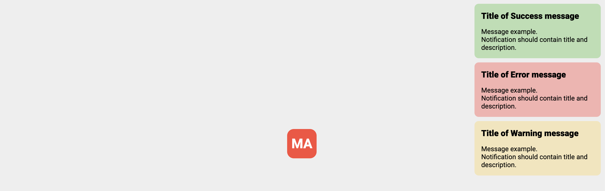

# Create a notification

### Description

- Created function `pushNotification`, which takes coordinates of the message, title, description, and type  (success, error and warning)
- `pushNotification` creates an element to display the message, appends it to the document, and hides it from the DOM after 2 seconds.

### Stack

- HTML (BEM)
- CSS
- JS

### Tools

- ESlint
- Prettier
- Cypress
- Mochawesome
- Parcel

### Demo links

- [Demo](https://AndriiZakharenko.github.io/notification/)

### Reference Image

